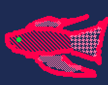

## About Me

Hello! I'm a junior at Northwestern University in Evanston, studying Chemical Engineering and Machine Learning. 

I am passionate about sustainability, computing, and advanced fabrication methods. Beyond my work, I enjoy game design, puzzles, and electronic music.

## Research Interest

I am currently researching the doping of 2-D materials via organic surface functionalization. Before that, I was researching optoelectronic applications of single-walled carbon nanotubes and their purification via density gradient centrifugation and dialysis.

In addition, I am very interested in research in computational medicine and biology, which I hope to begin this summer.

## Publications

1. Will happen *soon*

Year | Award | Category
-----|-------|--------
2022 | Best Design | Won at Northwestern DTC Design Expo
